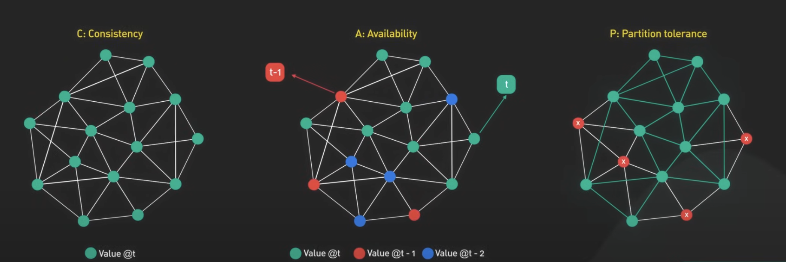

# CAP Theorem

Consistency: Property that describes tha ability of all nodes in a distributed system to have a consistent/same view of the data.

Availability: Property of a system to respond to user requests at all times

Partition tolerance: Ability of a distributed system to continue working when there is a network partition. A network partition happens when any number of nodes in the system are unable to connect to the other nodes due to some kind of error.

## The CAP theorem restriction

When a network partition happens in a distributed system, the system will have to choose to prioritize either consistency or availability. You can't have both at the same time.

If, for example, you have a banking system consistint of multiple ATMs and a network partition occurs, allowing customers to execute deposits and withdraws could cause data inconsistencies between ATMs, as they are not connected to each other at that moment in time. This could lead to over-withdraws and negative balances, for example. So the bank would have to choose to either make the system available for users to use, or prioritize consistency and prevent users from using the service.

## Resources:

- https://www.youtube.com/watch?v=BHqjEjzAicA

