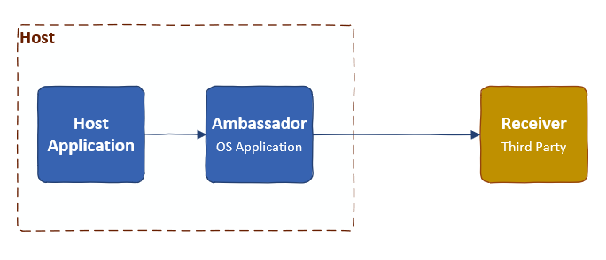

# Ambassador pattern

- Single node pattern composed of two containers: the application and the ambassador.
- The ambassador is responsible for brokering the application's requests to the outside world.

## Implementation

- Coscheduled into an atomic "container group" (example: `pod` API in Kubernetes).
- Share resources like network.

## Use cases

- Deploying an ambassador responsible for brokering application's requests to a sharded service (like sharded Redis)
  - Could be used instead of a single load balancer located in front of the sharded service
- Deploying an ambassador responsible for service discovery, identifying the IP address of the service and brokering requests to it (local VS Saas VS Cloud database)

# References

- Designing Distrubuted Systems: Patterns and Paradigms for Scalable, Reliable Services by Brendan Burns.
