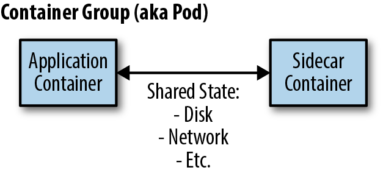
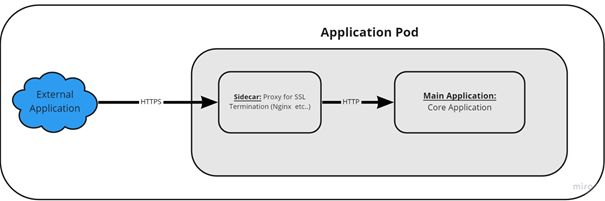

# Sidecar pattern

- Single node pattern composed of two containers: the application and the sidecar.
- The sidecar is responsible for augmenting the application container with additional functionality, often without the application's knowledge.

## Implementation

- Coscheduled into an atomic "container group" (example: `pod` API in Kubernetes).
- Share resources like filesystem (or part of it), hostmand, network...

## Use cases

- Applications that are difficult to change/maintain (legacy codebases).
- Examples:
  - HTTPS termination
  - Configuration Synschronization

## Designing a good sidecar container

### Parameterize the container

- Allow the container to have its behavior configured by environment variables which can be set by command line or by a configuration file.

### Define the container API

- Define the container's API and what it does
  - What HTTP endpoints it exposes? And what other HTTP calls it makes to the outside world?
  - What are the units used in environment variables or HTTP endpoints (if applicable)?

### Document your container

- Using the Dockerfile you can document your container by using:
  - `LABEL` to add metadata like version, author, etc. (see [OCI Image Specification](https://github.com/opencontainers/image-spec))
  - `EXPOSE` to declare the ports that the container will use.
  - `ENV` to declare the environment variables that the container will use and add default values

# References

- Designing Distrubuted Systems: Patterns and Paradigms for Scalable, Reliable Services by Brendan Burns.