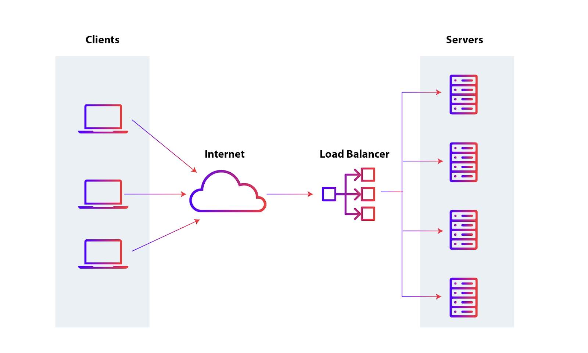

# Horizontal Scaling

## Load Balance

An application in front of servers that redirects traffic according to a certain algorithm to the other servers to allow higher availability and scaling.

This approach assumes all servers have access to the same data.

## Data splitting (sharding/partitioning)

Split data into multiple servers, allowing each one to be scaled independently according to its needs. You could have, for example, a server holding Europe related data, another one for the Americas and another one for Asia. Or you could shard by hashing.